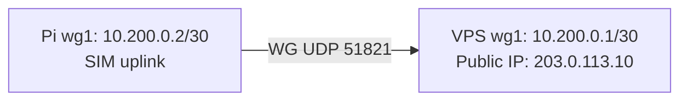
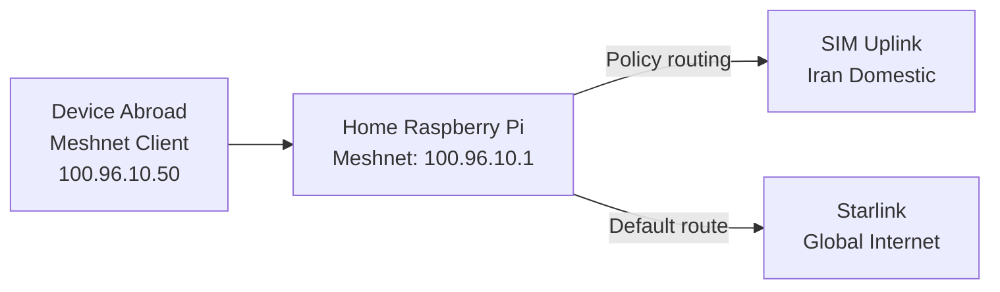

# NordVPN Meshnet Solution for Bypassing Internet Censorship in Iran

A comprehensive guide to accessing unrestricted internet in Iran using NordVPN Meshnet, Starlink, and a Raspberry Pi as a gateway.

## Table of Contents

- Overview
- Problem Statement
- Solution Architecture
- Prerequisites
- Network Topology
- Setup Instructions
  - Part 1: Raspberry Pi Configuration
  - Part 2: Iranian VPS Setup
  - Part 3: Reverse SSH Tunnel (Optional Alternative)
  - Part 4: Mobile Device Configuration
  - Part 5: Laptop Bridge Setup (Recommended)
  - Part 6: Abroad Access Configuration
- Testing & Verification
- Troubleshooting
- Security Considerations
- FAQ
- Contributing
- License
- Appendix A: Automation Scripts

---

## Overview

This solution enables users in Iran to:

- Access unrestricted internet when domestic internet is filtered/blocked.
- Route traffic through Starlink at home when away from home.
- Access Iranian domestic services when traveling abroad.
- Bypass CGNAT limitations using a reverse tunnel.
- Utilize NordVPN Meshnet for secure, encrypted peer-to-peer networking.

---

## Problem Statement

### The Challenge

During internet blackouts in Iran:

- Domestic websites and services remain accessible.
- International websites and VPN servers are blocked.
- Standard VPN connections fail.
- Home ISP uses CGNAT (no public IP for port forwarding).

### Available Resources

- Starlink modem at home (unrestricted internet access).
- Raspberry Pi connected to both Starlink and Iranian mobile network.
- Iranian VPS with public IP (reachable domestically).
- NordVPN subscription with Meshnet feature.

### The Goal

Create a network topology that allows a mobile device in Iran to route traffic through the home Starlink connection, even when:

- The mobile device cannot directly connect to international VPN servers.
- The home network is behind CGNAT (no public IP).
- Internet censorship blocks standard VPN protocols.

---

## Solution Architecture

### High-Level Architecture

- Meshnet runs only on the **Raspberry Pi** and **Iranian VPS**.
- Mobile connects to the VPS using **WireGuard** (domestic access only).
- VPS routes traffic to the Pi over **Meshnet**, and the Pi exits via **Starlink**.
- The VPS **cannot** reach NordVPN servers directly by default. It always tries direct access first and **automatically falls back** to routing through the Pi via a bootstrap WireGuard tunnel when blocked.

### Automatic Fallback Behavior

- A route monitor on the VPS checks `downloads.nordcdn.com:443` every 15 seconds.
- If it is reachable, the VPS uses its public gateway.
- If it is blocked, the VPS switches its default route to the Pi over `wg1`.

---

## Prerequisites

### Hardware

- Raspberry Pi 4 (2GB+ RAM recommended)
- MicroSD card (16GB+)
- Ethernet cable
- Starlink modem/router (or bypass mode)
- Iranian SIM router/modem (4G/5G)

### Software

- Raspberry Pi OS (Debian/Ubuntu based)
- NordVPN account with Meshnet feature
- Iranian VPS (Debian/Ubuntu)
- WireGuard
- SSH client

### Network

- Raspberry Pi interfaces:
  - `eth0` -> Starlink LAN (global)
  - `wlan0` -> SIM LAN (domestic)
- VPS:
  - Public IPv4 and SSH access on port `22`

---

## Network Topology

### Scenario 1: You are in Iran (blackout)

```mermaid
flowchart LR
  subgraph IRAN_CENSORED[IRAN CENSORED NETWORK]
    Mobile[Mobile Device\nWireGuard Client\n10.100.0.2/32]
    VPS[VPS (Iran)\nPublic IP: 203.0.113.10\nwg0: 10.100.0.1/24\nMeshnet: 100.96.10.2]
    Mobile -- "WG UDP 51820" --> VPS
  end

  subgraph HOME[HOME NETWORK]
    Pi[Home Raspberry Pi\nMeshnet: 100.96.10.1\neth0: Starlink\nwlan0: SIM]
  end

  VPS -- "Meshnet" --> Pi
  Pi -- "NAT out eth0" --> Internet[(Internet\nNordVPN Servers)]
```

### Bootstrap tunnel (required for fallback routing)



### Scenario 2: You are abroad



---

## Setup Instructions

### Part 1: Raspberry Pi Configuration

#### 1.1 Update OS and install packages

```bash
sudo apt-get update
sudo apt-get install -y wireguard iptables-persistent curl
```

#### 1.2 Enable IP forwarding

```bash
sudo sysctl -w net.ipv4.ip_forward=1
echo 'net.ipv4.ip_forward=1' | sudo tee /etc/sysctl.d/99-ipforward.conf
sudo sysctl --system
```

#### 1.3 Install NordVPN CLI

```bash
curl -sSf https://downloads.nordcdn.com/apps/linux/install.sh | sh
```

#### 1.4 Login and enable Meshnet

```bash
nordvpn login --token <NORDVPN_TOKEN>
nordvpn set meshnet on
```

#### 1.5 Allow routing and incoming traffic on Meshnet

```bash
nordvpn meshnet set allow-incoming on
nordvpn meshnet set allow-routing on
```

#### 1.6 Generate WireGuard keys for Pi (wg1)

```bash
umask 077
wg genkey | tee ~/pi_wg1_private.key | wg pubkey > ~/pi_wg1_public.key
cat ~/pi_wg1_public.key
```

#### 1.7 Configure WireGuard wg1 (Pi -> VPS bootstrap)

Create `/etc/wireguard/wg1.conf`:

```ini
[Interface]
Address = 10.200.0.2/30
PrivateKey = <PI_WG1_PRIVATE_KEY>

[Peer]
PublicKey = <VPS_WG1_PUBLIC_KEY>
Endpoint = 203.0.113.10:51821
AllowedIPs = 10.200.0.1/32
PersistentKeepalive = 25
```

Secure the file and enable the interface:

```bash
sudo chmod 600 /etc/wireguard/wg1.conf
sudo systemctl enable --now wg-quick@wg1
```

#### 1.8 Enable NAT from Meshnet to Starlink

Replace `nordlynx` if your Meshnet interface has a different name:

```bash
sudo iptables -t nat -A POSTROUTING -o eth0 -j MASQUERADE
sudo iptables -A FORWARD -i nordlynx -o eth0 -j ACCEPT
sudo iptables -A FORWARD -i eth0 -o nordlynx -m state --state ESTABLISHED,RELATED -j ACCEPT
sudo netfilter-persistent save
```

---

### Part 2: Iranian VPS Setup

#### 2.1 Update OS and install packages

```bash
sudo apt-get update
sudo apt-get install -y wireguard curl iproute2
```

#### 2.2 Install NordVPN CLI

```bash
curl -sSf https://downloads.nordcdn.com/apps/linux/install.sh | sh
```

#### 2.3 Login and enable Meshnet

```bash
nordvpn login --token <NORDVPN_TOKEN>
nordvpn set meshnet on
```

#### 2.4 Generate WireGuard keys for VPS (wg1 and wg0)

```bash
umask 077
wg genkey | tee ~/vps_wg1_private.key | wg pubkey > ~/vps_wg1_public.key
wg genkey | tee ~/vps_wg0_private.key | wg pubkey > ~/vps_wg0_public.key
cat ~/vps_wg1_public.key
cat ~/vps_wg0_public.key
```

#### 2.5 Configure WireGuard wg1 (VPS <- Pi bootstrap)

Create `/etc/wireguard/wg1.conf`:

```ini
[Interface]
Address = 10.200.0.1/30
ListenPort = 51821
PrivateKey = <VPS_WG1_PRIVATE_KEY>

[Peer]
PublicKey = <PI_WG1_PUBLIC_KEY>
AllowedIPs = 10.200.0.2/32
PersistentKeepalive = 25
```

Secure the file and enable:

```bash
sudo chmod 600 /etc/wireguard/wg1.conf
sudo systemctl enable --now wg-quick@wg1
```

#### 2.6 Configure WireGuard wg0 (mobile -> VPS)

Create `/etc/wireguard/wg0.conf`:

```ini
[Interface]
Address = 10.100.0.1/24
ListenPort = 51820
PrivateKey = <VPS_WG0_PRIVATE_KEY>

[Peer]
PublicKey = <MOBILE_PUBLIC_KEY>
AllowedIPs = 10.100.0.2/32
```

Secure the file and enable:

```bash
sudo chmod 600 /etc/wireguard/wg0.conf
sudo systemctl enable --now wg-quick@wg0
```

#### 2.7 Route VPS traffic through the Pi (Meshnet)

```bash
nordvpn meshnet peer list
nordvpn meshnet route add <PI_MESHNET_DEVICE_NAME>
```

#### 2.8 Automatic fallback routing (required)

Create the route watcher script (always tries direct access first, falls back to Pi when blocked).

Find your current public gateway IP (use this value in the script below):

```bash
ip route | awk '/default/ {print $3}'
```
```bash
sudo tee /usr/local/sbin/meshnet-route-watch.sh > /dev/null <<'SCRIPT'
#!/usr/bin/env bash
set -euo pipefail

CHECK_HOST="downloads.nordcdn.com"
CHECK_PORT=443
WG_IFACE="wg1"
WG_GATEWAY="10.200.0.2"
PUBLIC_GATEWAY="<VPS_PUBLIC_GATEWAY>"

check_reachability() {
  timeout 3 bash -c "</dev/tcp/${CHECK_HOST}/${CHECK_PORT}" >/dev/null 2>&1
}

set_default_public() {
  ip route replace default via "${PUBLIC_GATEWAY}"
}

set_default_wg() {
  ip route replace default via "${WG_GATEWAY}" dev "${WG_IFACE}"
}

while true; do
  if check_reachability; then
    set_default_public
  else
    set_default_wg
  fi
  sleep 15
done
SCRIPT
sudo chmod +x /usr/local/sbin/meshnet-route-watch.sh
```

Create the systemd unit:

```bash
sudo tee /etc/systemd/system/meshnet-route-watch.service > /dev/null <<'UNIT'
[Unit]
Description=Meshnet route watcher (fallback to Pi when NordVPN blocked)
After=network-online.target wg-quick@wg1.service
Wants=network-online.target

[Service]
Type=simple
ExecStart=/usr/local/sbin/meshnet-route-watch.sh
Restart=always
RestartSec=5

[Install]
WantedBy=multi-user.target
UNIT
```

Enable and start it:

```bash
sudo systemctl daemon-reload
sudo systemctl enable --now meshnet-route-watch.service
```

#### 2.9 Open required ports (if firewall is enabled)

```bash
sudo ufw allow 51820/udp
sudo ufw allow 51821/udp
```
--- 

### Part 3: Reverse SSH Tunnel (Optional Alternative)

If WireGuard bootstrap is not possible, use reverse SSH to expose a SOCKS5 proxy on the VPS that forwards through the Pi over the domestic SIM.

Install autossh on the Pi:

```bash
sudo apt-get update
sudo apt-get install -y autossh
```

Create SSH key and copy to VPS:

```bash
ssh-keygen -t ed25519 -f ~/.ssh/pi_to_vps -N ""
ssh-copy-id -i ~/.ssh/pi_to_vps.pub user@203.0.113.10
```

Create a persistent reverse tunnel:

```bash
autossh -M 0 -N -i ~/.ssh/pi_to_vps \
  -o "ServerAliveInterval 30" \
  -o "ServerAliveCountMax 3" \
  -R 1080:localhost:1080 user@203.0.113.10
```

Start a local SOCKS proxy on the Pi:

```bash
ssh -D 1080 -N user@localhost
```

---

### Part 4: Mobile Device Configuration

#### 4.1 Create WireGuard profile

```ini
[Interface]
Address = 10.100.0.2/32
PrivateKey = <MOBILE_PRIVATE_KEY>
DNS = 1.1.1.1

[Peer]
PublicKey = <VPS_WG0_PUBLIC_KEY>
Endpoint = 203.0.113.10:51820
AllowedIPs = 0.0.0.0/0
PersistentKeepalive = 25
```

#### 4.2 Import into WireGuard app

- Android/iOS: WireGuard app -> Add tunnel -> Import.

---

### Part 5: Laptop Bridge Setup (Recommended)

If you want to share the connection from your laptop to other devices (Linux example):

#### 5.1 Enable IP forwarding

```bash
sudo sysctl -w net.ipv4.ip_forward=1
```

#### 5.2 NAT traffic from laptop LAN to WireGuard

```bash
sudo iptables -t nat -A POSTROUTING -o wg0 -j MASQUERADE
sudo iptables -A FORWARD -i wlan0 -o wg0 -j ACCEPT
sudo iptables -A FORWARD -i wg0 -o wlan0 -m state --state ESTABLISHED,RELATED -j ACCEPT
```

---

### Part 6: Abroad Access Configuration

When abroad, install NordVPN and join Meshnet directly.

```bash
nordvpn login --token <NORDVPN_TOKEN>
nordvpn set meshnet on
```

Optionally route domestic prefixes through the Pi (SIM uplink):

```bash
sudo ip route add 192.0.2.0/24 via 192.168.8.1 dev wlan0 table 200
sudo ip rule add to 192.0.2.0/24 lookup 200 priority 1000
```

---

## Testing & Verification

On VPS:

```bash
nordvpn meshnet peer list
ip route
systemctl status meshnet-route-watch
wg show
```

On Pi:

```bash
nordvpn meshnet peer list
ip a
iptables -t nat -L -n -v
wg show
```

On mobile:

- Connect WireGuard and open a blocked website.

---

## Troubleshooting

- Meshnet not routing: confirm `allow-routing` and `allow-incoming` on the Pi.
- No internet on mobile: check VPS default route and `meshnet-route-watch` status.
- WireGuard down: check `wg show` and confirm ports `51820/51821` open.

---

## Security Considerations

- Rotate WireGuard keys regularly.
- Restrict SSH access (use key-only auth).
- Lock WireGuard `AllowedIPs` to your device only.

---

## FAQ

**Q: Does the mobile device need NordVPN access?**
A: No. The mobile device only needs WireGuard access to the VPS.

**Q: What happens when NordVPN servers are blocked from the VPS?**
A: This is the default case. The route watcher always tries direct access and automatically falls back to routing through the Pi over `wg1`.

---

## Contributing

PRs are welcome. Keep everything ASCII and document commands for reproducibility.

---

## License

MIT

---

## Appendix A: Automation Scripts

Automation scripts are provided in `scripts/`:

- `scripts/pi-setup.sh`
- `scripts/vps-setup.sh`

Use:

```bash
chmod +x scripts/pi-setup.sh scripts/vps-setup.sh
sudo ./scripts/pi-setup.sh
sudo ./scripts/vps-setup.sh
```

Each script prompts for required values and writes configuration files securely.
